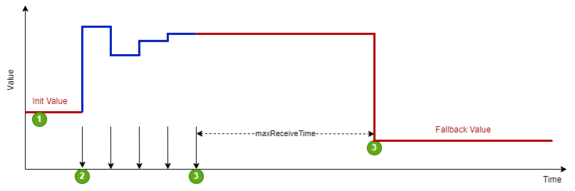

# SGr Attributes

This documentation describes the list of generic attributes.

 Generic attributes incorporate hierarchical inheritance as follows:
- Generic attributes always apply to the data point
- Generic attributes defined on functional profile level apply to all data points of the same functional profile.
- Generic attributes defined on device level apply to all functional profiles, and thus to all data points of the device
If the same attribute is defined on multiple levels the most specific definition superseeds any other definition (i.e. data point over functional profile over).

## Static Data Point Attributes
These values describe the measurement limits for data points. Depending on the definition level they apply either to a specific data point, every data point of a functional profile, or the the entire device.

These attributes are generally used to search for devices that fullfil a set of  minimum requirements to support a specific use case.

| SGr Attribute | Data Type | Description | Example |
|---------------|-----------|-------------|---------|
| maxVal | float | upper range limit. | 200.0 |
| minVal | float | lower range limit. | 0.0 |
| valueType | enum | MeasValueType: type of measurement. Possbile values are "value", "min", max", "average", "stdDev" | value |
| specQualityRequirement | string | indicates Quality requirements fullfilled like formal certifications | METAS  |
| precision | float | the precision of a measurement, calculation result or result of a controls process | 2.0% |
| maxLatencyTimeMs | unsignedLong | Maximum time in milliseconds from capturing of measured value until ready at the external interface (i.e. analog-digital conversion time) | 10 ms |
| sampleRate | unsignedLong | SampleRate in milliseconds | 200 ms |

## Stability Fallback
A consumer or a generating system receives the permit for a load change for a certain period of time. This time is always set to 0 each time a confirmation message is received (HeartBeat).

The figure below depicts the typical flow
1. the device starts at initial value.
2. regular communication starts. The communicator periodically sets new set values.
3. communication breaks. The device recieves its last set value.
4. after reaching the timeout the device automatically sets the fallback value.

| Stability Fallback Value | Data Type | Description | Example |
|---------------|-----------|-------------|---------|
| maxReceiveTime | float | If the device does not receive any communication within this time the device applies the fallback.| 3600.0 s |
| initValue | float | Initial value the device before the communicator sets this value (e.g.  at startup, or beginning of cycle).| 6.0 A |
| fallbackValue | float | Value the device uses in case of a fallback | 6.0 A |

## Smooth Transition
The time behavior of a transition from a power adjustment (positive as well as negative) can be determined by several time values, so that this starts with a random time delay, changes via a ramp and an expiry time with return to the initial value. To avoid return to the initial value the device must either specify the revert time to zero (i.e. no return), or the communicator must repeat the target value before the revert time window expires.

The figure below depicts the typical flow
1. the command for the new target value is received
2. the device randomly starts the ramp, but latest after winTms
3. the ramp reaches the new target value after rmpTms
4. if no new target value is received, the device starts returning to the old target value after rvtTms
5. the ramp reaches the old target value after rmpTms

| Smooth Transition Value | Data Type | Description | Example |
|---------------|-----------|-------------|---------|
| winTms | unsigned long | indicates a time window in which the new operating mode is started randomly. The time window begins with the start command of the operating mode. The value 0 means immediate | 300 s |
| rmpTms | unsigned long | specifies how quickly the changes should be made. The corresponding value is gradually changed from the old to the new value in the specified time.| 450 s |
| rvrtTms | unsigned long | determines how long the operating mode should be active. When the time has elapsed, the operating mode is automatically terminated. If rvrtTms = 0 (standard value), the operating mode remains active until a new command is received.| 7'200 s|

## Data Point Quality

SGr has attributes to denote the quality of the mesaured value. The presence of any quality attributes either on functional profile or data point level indicate that the com handler will provide these dynamic attributes at run time (see documentation of SGr com handler libs)

| SGr Attribute | Data Type | Description | Example |
|---------------|-----------|-------------|---------|
| valueSource | enum | Value source kind related to SGr level 6 applications. Potential values are measuredValue, calculatedValue, empiricalValue | measuredValue |

## TODO
| SGr Attribute | Data Type | Description | Example |
|---------------|-----------|-------------|---------|
| curtailment | float | Used in state-based reduction schemes. This value specifies the reduction in percent for the reduced operation mode. | 40% | 
| minLoad | float |  |
| maxLockTimeMinutes | float |  |
| minRunTimeMinutes | float |  |
| valueByTimeTableMinutes | float |  |
| flexAssistance | sgr:SGrFlexAssistanceType | Systems with more than One communicator need a definition of the priority of the commands / demands for a flexibility requirement. This element defines the kind of a such a command (servicable for net (DSO), energy or system (TNO)) and its priority (SHALL / SHOULD / MAY) |

## Open Points
- Quality
  - the com handler implementations should provide the values of these attributes. Generate an issue for java / python
  