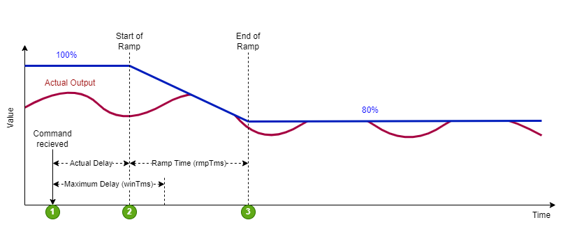
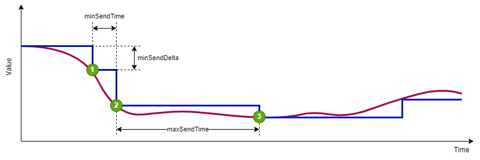

# SGr Attributes

This documentation describes the list of generic attributes for devices, functional profiles and data points.

## Static Data Point Attributes
These values describe the measurement limits for data points. Depending on the definition level they apply either to a specific data point, every data point of a functional profile, or the the entire device.

These attributes are generally used to search for devices that fullfil a set of  minimum requirements to support a specific use case.

| SGr Attribute | Data Type | Description | Example |
|---------------|-----------|-------------|---------|
| maxVal | float | upper range limit. | 200.0 |
| minVal | float | lower range limit. | 0.0 |
| specQualityRequirement | string | indicates Quality requirements fullfilled like formal certifications | METAS  |
| precision | float | the precision of a measurement, calculation result or result of a controls process | 2.0% |

## Configuration attributes concerning data point communication
These values give further information on how to use the data points.

### Stability Fallback
A consumer or a generating system receives the permit for a load change for a certain period of time. This time is always set to 0 each time a confirmation message is received (HeartBeat).

| Stability Fallback Value | Data Type | Description | Example |
|---------------|-----------|-------------|---------|
| maxReceiveTime | | | |
| initValue | | | |
| fallbackValue | | | |

### Smooth Transition
The time behavior of a transition from a power adjustment (positive as well as negative) can be determined by several time values, so that this starts with a random time delay, changes via a ramp and an expiry time with return to the initial value.

| Smooth Transition Value | Data Type | Description | Example |
|---------------|-----------|-------------|---------|
| winTms | unsigned long | indicates a time window in which the new operating mode is started randomly. The time window begins with the start command of the operating mode. The value 0 means immediate | 60'000 ms |
| rmpTms | unsigned long | specifies how quickly the changes should be made. The corresponding value is gradually changed from the old to the new value in the specified time.| 43'200'000 ms |
| rvrtTms | unsigned long | determines how long the operating mode should be active. When the time has elapsed, the operating mode is automatically terminated. If rvrtTms = 0 (standard value), the operating mode remains active until a new command is received.| |

## Communication Timing Attributes
Timing attributes describe the details of asynchronous sampling, where the product itself pushes data point measurements to its suscribers (e.g. communicator). Especially in larger networks these attributes are absolutely necessary to avoid cluttering and overloading of the transport layer.

The SGr timing attributes allow for heart-beat based data point sampling as well as interrupt-based sampling if the measured value changes beyond a configured threshold.

| SGr Attribute | Data Type | Description | Example |
|---------------|-----------|-------------|---------|
| minSendDelta | float | A measured value difference that must lead to a notification (interrupt-based sampling). Note that the device will wait at least minSendTime before resending a new value. | 200 mV |
| minSendTime | float | The fastest possible or allowable sequence of notifications in seconds (i.e. maximum sampling frequency) | 1.0 s |
| maxSendTime | float | The maximum time between 2 notifications in seconds (heart-beat based sampling)| 10 s |
| maxReceiveTime | float | The maximum time between 2 notifications in seconds, after which a timeout has to be generated including a reset to the default value. | 20 s |
| maxLatencyTime | unsignedLong | Maximum occurring or permitted delay time, e.g. of a data transaction |0.1 s |

## Time stamps
- timeStampLog
- timeRange

## Data point state
- valueType
- valueTendency
- valueState

## Transport Layer: Modbus
- scalingByMulPwr
- stepByIncrement
- sunssf
- pollLatencyMS
- timeAlignedNotification

## Transport Layer: Contact
- stabilisationTime

## TODO
Curtailment, MinLoad, MaxLoad MaxLockTime MinRuntime

| SGr Attribute | Data Type | Description | Example |
|---------------|-----------|-------------|---------|
| timeStampLog | dateTime | This is the date Time Value indicates that any value generation must be paired with the time of either a measuement was taken or where a higher controls software level indicates when it got the value |
| timeRange | sgr:SGrTimeRangeType |  time range min…max |
| valueType | sgr:SGrMeasValueType | MeasValueType: type of measurement. Possbile values are "min", max", "average", "stdDev" |
| valueState | sgr:SGrMeasValueStateType | MeasValueState: Status / validity of the measurement. Possible values are "normal", "outOfRange", "error" |
| valueTendency | sgr:SGrMeasValueTendencyType | value trend based on timely changes, potential values are rising, stable, falling |
| valueSource | sgr:SGrMeasValueSourceType | Value source kind related to SGr level 6 applications. Potential values are measuredValue, calculatedValue, empiricalValue |
| sampleRate | float | SampleRate in milliseconds |
| curtailment | float |  |
| minLoad | float |  |
| maxLockTimeMinutes | float |  |
| minRunTimeMinutes | float |  |
| valueByTimeTableMinutes | float |  |
| flexAssistance | sgr:SGrFlexAssistanceType | Systems with more than One communicator need a definition of the priority of the commands / demands for a flexibility requirement. This element defines the kind of a such a command (servicable for net (DSO), energy or system (TNO)) and its priority (SHALL / SHOULD / MAY) |

## Open Points
- maxLatencyTime unit should be float (for consistency, and sub-second latency should be supported)
- maxReceiveTime - can we remove this?