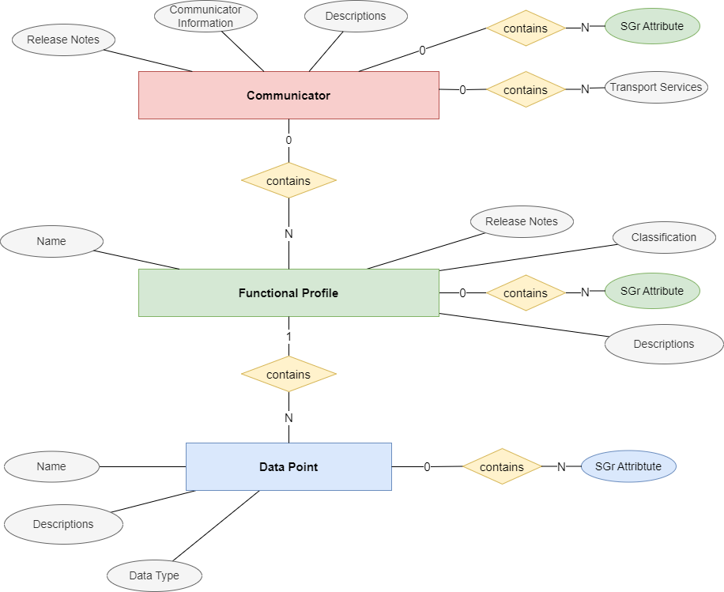

# External Interface Description Schema

## Use case

A communicator description contains information about the communicator and the function profiles that can be controlled by the communicator.

This allows to find matching products that can be used be the communicator.

## General Structure
The schema of the communicator interface description is structured on two levels:
- Communicator information concerning manufacturer and product data, and the supported transport layers
- A list of supported functional profiles
- A list of data points with generic data types

The figure below shows the entity relation model of the communicator interface description

# Communicator Elements

### Release Notes
The release note section contains meta data that descibe history and current state of the communicator

| Element   | Description |
|-----------|-------------|
| state     | one of Draft, Review, Released, Revoked |
| remarks   | Optional, arbitrary text. Can be usefull e.g. during draft phase. |
| changeLog | Optional, can occure multiple times. Contains release notes to the version concerned |

### Communicator Information
| Element          | Description |
|------------------|-------------|
| Name             | Communicator Name |
| Manufacturer     | Manufacturer |
| specOwnerId      | Owner of the declaration (normally identical to manufacturer, but different for 3rd party declarations) |
| CommunicatorCategory | Communicator Category |
| SoftwareRevision | Software revision of communicator |

### Communicator Attributes

| Element | Description |
| ------- | ----------- |
| levelOfOperation | levelOfOperation defines a controls complexity  (see [LevelOfOperation.md](LevelOfOperation.md) ), and is defined by the highest level of the communicator |

### Descriptions
| Element     | Description |
|-------------|-------------|
| alternativeNames  | a list of relevant namespaces list for to display names used in different standards like EEBUS, IEC6850,, SAREF4ENER etc. (see [AlternativeNames](AlternativeNames.md))|
| legibleDescription | optional, can occur multiple times, but ideally just a once per language. Contains details concerning the intended use case of the communicator. |

### Transport Services
| Element     | Description |
|-------------|-------------|
| supportedTransportServices | Supported transport services (set of Generic, Contacts, Modbus, RESTfulJSON) |

## Functional Profiles
Each communicator contains a list of functional profiles.
| Element     | Description |
|-------------|-------------|
| profileName | Instance name of the specified functional profile, containing Release Notes, Classification, Description |
| functionalProfile | Copy of the standardized [functional profile](functionalProfile.md) |
| programmerHints   | optional, can occur multiple times, but ideally just a once per language. Contains details for the programmer. |

## Data Points
Each functional profile instance contains a list of data points in accordance with the standardized functional profile.
| Element     | Description |
|-------------|-------------|
| Data point | Data point of the standardized [functional profile](functionalProfile.md), containing name, description, and basic data type |
| programmerHints   | optional, can occur multiple times, but ideally just a once per language. Contains details for the programmer. |
