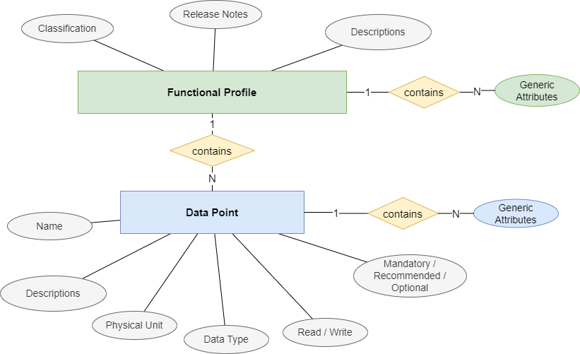

# Functional Profile Schema

## Use Case

A functional profile contains a set of data points that support the implementation of a specific use case. It thereby
focuses entirely on the functionality. Any transport-specific details are not part of the functional profile (e.g.
on how to get or set a data point on a specific product).

The main intent is to allow communicator manufacturers to easily implement their use cases based on logically grouped data points, while device-specific communication details to the SGr communicator library. Any product that supports the functional profiles required for a specific use case is therefore  automatically compatible and can be used without changing the implementation.

## General Structure
The schema of the functional profile is structured on two levels:
- information concerning the entire functional profile
- a list of data points

The figure below shows the entity relation model of the functional profile

## Functional Profile Attributes

### Classification
SGr classifies and identifies any functional profile by the following values

| Element               | Description |
|-----------------------|-------------|
| specificationOwnerIdentification          | Identifier of the functional profile owner. |
| functionalProfileCategory | Functional profile class (see [SGrFunctionalProfileCategory.xsd](../SchemaDatabase/SGr/Generic/BaseType_FunctionalProfileCategory.xsd) ) |
| functionalProfileType       | Functional profile subclass |
| levelOfOperation   | Level of control defining the complexity (see [LevelOfOperation](LevelOfOperation.md) ) |
| versionNumber         | Version of the functional profile. Changes in primaryVersionNumber indicate breaking changes, changes in secondaryVersionNumber indicate complimentary changes, changes in subReleaseVersionNumber are without impact on the functionality | 

### Release Notes
The release notes section contains meta data that describes the history and the current state of the functional profile

| Element   | Description |
|-----------|-------------|
| state     | One of Draft, Review, Released, Revoked |
| remarks   | Optional, arbitrary text. Can be useful e.g. during draft phase. |
| changeLog | Optional, can occur multiple times. Contains release notes to the version concerned |

### Descriptions
| Element     | Description |
|-------------|-------------|
| alternativeNames  | A list of relevant namespaces list for to display names used in different standards like EEBUS, IEC6850,, SAREF4ENER etc. (see [AlternativeNames](AlternativeNames.md))|
| legibleDescription | Optional, can occur once per language. Contains details concerning the intended use case of the functional profile. |

## Generic Attributes
SGr allows to associate attributes to a functional profile (i.e. concerning every data point). See [GenericAttributes](GenericAttributes.md) for details. Any attribute defined on the functional profile level are mandatory to any product that implements this functional profile. However, the product can optionally add further attributes based on its own needs.

# Data Point Attributes
| Element     | Description |
|-------------|-------------|
| datapointName | Name of the data point. Should be unique within the functional profile |
| dataDirection | R if data point can be read, W for write, P for persistence |
| presenceLevel | Datapoint availability: Mandatory, Recommended, Optional |
| unit | Physical unit of data point |
| dataType |  Data type of the value for the point type |
| alternativeNames | A list of relevant namespaces list for to display names used in different standards like EEBUS, IEC6850,, SAREF4ENER etc. (see [AlternativeNames](AlternativeNames.md))|
| legibleDescription | Optional, can occur once per language. Contains details concerning the intended use case of the functional profile. |

## Generic Attributes
SGr allows to associate attributes to a data point. See [GenericAttributes](GenericAttributes.md) for details.
Any attribute defined on the functional profile level is mandatory to any product that implements this functional profile. However, the product can optionally add further attributes based on its own needs.
The generic attributes in the functional profile can be empty or examples - the actual values are defined in the product XML (they are not read from the product).

## New Functional Profiles

## File Naming Schema
Functional profiles should have the following file naming conventions:

`FP_[specificationOwnerIdentification]_[FunctionalProfileCategory]_[FunctionalProfileType]_[levelOfOperation]_[majorVerion].[minorVerion].xml`

## Descriptions
Functional profile descriptions should be structured as follows:
- Image indicating the typical use of the functional profile, together with an easily understandable title
- Short explanation (i.e. long version of the title)
- Detailed explanation, including very attribute.
- Description on how to apply the functional profile concerning presence level (i.e. how to handle recommended and optional data points)
