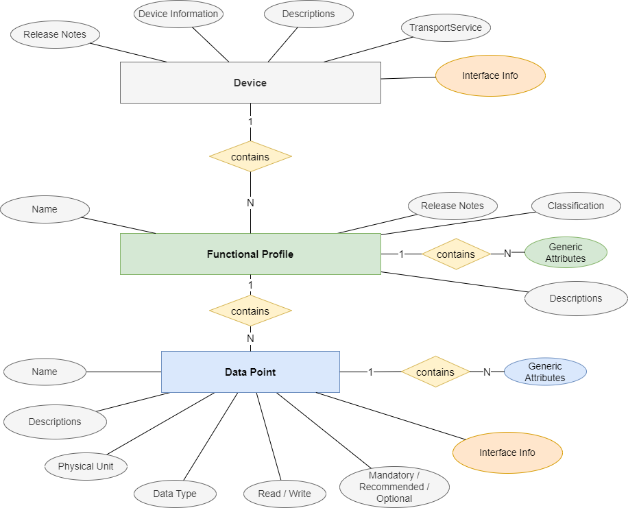

# Product Description Schema

## Use case

A product description contains information about the device, its supported functional profiles, and how
the data points of the functional profiles can be accessed through the communication interface.

This allows potential controllers to easily integrate, implement, or access any SmartGridready certified product
through a standardized set of functionalities, and thereby greatly simplifies scale-up to support a wide range of products.

## General Structure

The schema of the product description (EID, External interface definition) is structured on four levels:
- Device information concerning manufacturer and product data, and the basic configuration of the communication interface.
- A list of communication interfaces (e.g. Contacts, RESTfulJSon, Modbus, Messaging). Although it is in principle possible to define more than one communication interface in one product description if a device supports more than one type of communication, it is recommended to separate them into separate product descriptions.
- A list of supported functional profiles. The functional profiles must have the same content as those defined in the list of functional profiles. (see [Functional Profile Structure](functionalProfile.md), [List of Functional Profiles](https://library.smartgridready.ch/FunctionalProfileTemplate)).
- A list of data points (as defined in the respective functional profile definition) together with communication interface details defining how to access the individual data point.

The figure below shows the entity relation model of the product description.

## Device Elements

### Device Identification

| Element          | Description |
|------------------|-------------|
| deviceName       | name of the device |
| manufacturerName | name of the manufacturer |
| specificationOwnerIdentification | Owner of the declaration (normally identical to manufacturer, but different for 3rd party declarations) |

### Release Notes

The release note section contains meta data that describe the history and the current state of the functional profile

| Element   | Description |
|-----------|-------------|
| state     | one of `Draft`, `Review`, `Released`, `Revoked` |
| remarks   | optional, arbitrary text. Can be useful e.g. during draft phase. |
| changeLog | optional, can occurs multiple times. Contains release notes to the version with version, date, author, and comment |

### Device Information

| Element          | Description |
|------------------|-------------|
| alternativeNames  | a list of relevant name spaces list for to display names used in different standards like EEBUS, IEC6850, SAREF4ENER etc. (see [AlternativeNames](AlternativeNames.md))|
(AlternativeNames.md) |
| legibleDescription | can occur once per language. Contains details concerning the intended use case of the functional profile. |
| deviceCategory        | type of the device - see [Device Category](deviceCategory.md) |
| isLocalControl   | Value `false` means "is cloud control device", indicating that this service is based on cloud. `true` indicates that services are provided within the range of the local area. |
| softwareRevision | software version information for this product declaration |
| hardwareRevision | hardware version information for this product declaration |
| brandName | branding information |
| powerSource | power supply type |
| manufacturerSpecificationIdentification | manufacturers specification identifier |
| manufacturerLabel | manufacturers label of the device |
| generalRemarks | remarks and non disclaimer statements |
| levelOfOperation | level of control defining the complexity (see [LevelOfOperation](LevelOfOperation.md) ), and is defined by the highest level of the devices functional profile |
| versionNumber | version number of the Product Description (EID) - first two parts should be the same as in the file name |
| programmerHints | additional device-specific implementation hints for this device |

### Configuration

Values in the product definition can contain place holders e.g. for IP addresses, device ID's, ...
These place holders are keys enclosed with double braces `{{}}`. The values for the keys must be provided during the instantiation of the product.

Example: `{{ipaddress}}`

The keys should be documented in a list of configuration items. Each item contains

| Element          | Description |
|------------------|-------------|
| name             | key name |
| dataType         | the data type of this value|
| defaultValue     | optional default value  |
| configurationDescription | description of the configuration item - can be repeated for each language|

Each configurationDescription element contains

| Element          | Description |
|------------------|-------------|
| textElement      | description of the configuration item |
| language         | the language |
| label | short label to be displayed during the configuration of the device |

## Communication Interface

Although it is possible to define a list of communication interfaces for future use, it is strongly recommended to
define one product description for each communication interface the product supports.
(Also the current support libraries do not support multiple communication interfaces.)

Currently supported communication interfaces are

| Interface     | Description |
|-------------|-------------|
| contactInterface | product with physical contacts | 
| restApiInterface | product with a RESTfulJSON interface | 
| modbusInterface | product with a Modbus interfacee | 
| messagingInterface | product with a messaging interface (e.g. MQTT) |

Depending on the type of root element a transport-service specific structure is present, describing the device-specific communication interface configuration

### Contacts Communication Interface

The contacts interface has the following properties contained in a `contactInterfaceDescription`

| Element          | Description |
|------------------|-------------|
| numberOfContacts      | number of contacts |
| contactStabilisationTimeMs | Time in milliseconds until a contact has reached a stable state after switching |

Usually, a product description with contacts is only for documentation, as the access to contacts from a communicator is not possible.

### Rest API Communication Interface

The RestAPI interface has the following properties contained in a `restApiInterfaceDescription`

| Element          | Description |
|------------------|-------------|
| restApiInterfaceSelection      | Type of Rest Api interface as one of `TCPV4`, `TCPV6`, `URI` |
| restApiUri | Address of the RestAPI server |
| restApiAuthenticationMethod | Authentication method as one of `NoSecurityScheme`, `BearerSecurityScheme`, `ApiKeySecurityScheme`, `BasicSecurityScheme` `DigestSecurityScheme`, `PskSecurityScheme`, `OAuth2SecurityScheme`, `HawkSecurityScheme`, `AwsSignatureSecurityScheme` |
| restApiBearer | Service calls for authentication |
| restApiBasic | User name and password for authentication |
| restApiVerifyCertificate | Indicates whether a certificate is required |

### Modbus Communication Interface

The Modbus interface has the following properties contained in a `modbusInterfaceDescription`

| Element          | Description |
|------------------|-------------|
| modbusInterfaceSelection      | Type of Rest Modbus interface as one of `RTU`, `TCPIP`, `UDPIP`, `RTU-ASCII`, `TCPIP-ASCII`, `UDPIP-ASCII` |
| modbusTcp | Contains for TCP the connection properties `port`, `address` (IP-Address), and `slaveId` |
| modbusRtu | Contains for TCP the serial connection properties `slaveAddr`, `portName`, `"baudRateSelected"`, `byteLenSelected`, `paritySelected`, `stopBitLenSelected`, and `serialInterfaceCapability` |
| firstRegisterAddressIsOne | Address of the first register |

The `serialInterfaceCapability` defines the possible values for the communication settings

| Element          | Description |
|------------------|-------------|
| baudRatesSupported      | List of baud rates supported by the device |
| byteLenSupported      | List of byte lengths supported by the device |
| paritySupported      | List of parities supported by the device |
| stopBitLenSupported      | List of stop bits supported by the device |

Furthermore, the Modbus interface has the following additional properties contained in a `modbusAttributes`

| Element          | Description |
|------------------|-------------|
| scalingFactor      | Factor with `multiplicator` and `powerof10` for the adjustment of device values to the generic values from the function profile (this can also be defined separately for each data point) |
| stepByIncrement      | Step for increment - used to skip illegal values (for future use) |
| sunssf      | Sunpec specific attribute |
| pollingLatencyMs      | The time for a master slave communication cycle in ms |
| accessProtection      | Access protection (for future use) |
| layer6Deviation      | Special handling of the interface value if that contains more than one value in one register |

### Messaging Communication Interface

The Messaging interface has the following properties contained in a `messagingInterfaceDescription`

| Element          | Description |
|------------------|-------------|
| platform      | type of the messaging platform as one of `MQTT5`, `Kafka` |
| messageBrokerList | contains a list of message brokers each with `host`, `port`, and optional `tls` and `tlsVerifyCertificate` |
| clientId | client identifier |
| messageBrokerAuthentication | either `basicAuthentication` with `username` and `password` or `clientCertificateAuthentication` with `keystorePath`, `keystorePassword`, `truststorePath` and `truststorePassword` |

## Functional Profiles

Each device contains a list of functional profiles.

| Element     | Description |
|-------------|-------------|
| profileName | instance name of the functional profile entry - a device can include a specific functional profile more than once but with different profile instance names |
| functionalProfile | copy of the standardized [functional profile](functionalProfile.md) |
| programmerHints   | optional, can occur once per language. Contains details for the programmer. |

## Data Points

Each functional profile instance contains a list of data points in accordance with the standardized functional profile.

A data point contains almost the same information as the data point within a [functional profile](functionalProfile.md#data-points).

| Element     | Description |
|-------------|-------------|
| dataPointName | name of the data point (unique on functional profile) |
| dataDirection | a data direction defining whether the data can be `R` read,  `W` written, `WR` read and written, or whether the data is [`C` constant](#constant-data-points) |
| dataType | generic data type - same as in functional profile description |
| value   | constant value of the data point - only for [constant data points](#constant-data-points) |
| unit | the unit of the value |
| arrayLength | Optional, if present the data point is an array of specified length |
| minimumValue | minimum possible value (if standard libraries are used, smaller values result in an exception) |
| maximumValue | minimum possible value (if standard libraries are used, bigger values result in an exception) |
| unitConversionMultiplicator | factor for converting the device value into the value of the generic unit |
| alternativeNames  | a list of relevant name spaces list for to display names used in different standards like EEBUS, IEC6850, SAREF4ENER etc. (see [AlternativeNames](AlternativeNames.md))|
(AlternativeNames.md) |
| legibleDescription | can occur once per language. Contains details concerning the intended use case of the functional profile. |
| programmerHints | additional device-specific implementation hints for this device |

Additionally to these attributes, the data point can have additional attributes corresponding to the communication interface - see below.

### Sub Data Points

Data Points that are defined as Sub Data Points are handled in the same way as the normal data points with all consequences. But a sub data point can only be used in the device if the main data point is also used.

### Constant Data Points

Additional to the data points in the functional profile the product has the concept of constant data points that can implement the data point of the functional profile and that have a constant value.

For this, the data direction `C` is possible in products. In this case, a value must be defined for the data point.

### Additional values for Contacts interface

There are no additional attributes for the contacts communication interface.

### Additional values for RESTfulJSon interface

Each RESTfulJSon data point requires additional information in a `restApiDataPointConfiguration` with

| Element     | Description |
|-------------|-------------|
| dataType     | RestAPI data type as one of `JSON_number`, `JSON_string`, `JSON_boolean`, `JSON_object`, and `JSON_array`  |
| restApiServiceCall     | general service call |
| restApiReadServiceCall | service call for writing a value to the data point |
| restApiWriteServiceCall | service call for reading a value to the data point |

The data point can either use a `restApiServiceCall` or a `restApiReadServiceCall` and a `restApiWriteServiceCall`.

The structure of the service call is

| Element     | Description |
|-------------|-------------|
| requestHeader     | a list of header entries with `headerName` and `value`  |
| requestMethod | the request method as one of `GET`, `POST`, `PUT`, `PATCH`, or `DELETE` |
| requestPath | the request path |
| requestQuery | the request query as list of parameters |
| requestForm | the request form as list of parameters |
| requestBody | the request body |
| responseQuery | the response query with a JMES path mapping |
| valueMapping | the mapping to map a response to the generic JSon |

### Additional values for Modbus interface

Each Modbus data point requires additional information in a `modbusDataPointConfiguration` with

| Element     | Description |
|-------------|-------------|
| modbusDataType     | the Modbus data type as one of `boolean`, `int8`, `int16`, `int32`, `int64`, `int8U`, `int16U`, `int32U`, `int64U`, `float32`, `float64`, `dateTime`, `string`, `enum`, and `bitmap`  |
| address | the register number |
| bitRank | the bit rank used to define a bit address for coils and discreteInput |
| registerType | the register type as one of `Coil`, `DiscreteInput`, `InputRegister`, or `HoldRegister` |
| timeToLiveMs | block cache time in milliseconds |
| requestBody | the request body |
| responseQuery | the response query with a JMES path mapping |
| valueMapping | the mapping to map a response to the generic JSon |

Additionally, a `blockCacheIdentification` to handle reading of more than one register and holding them in a cache until `timeToLiveMs` is expired.

Furthermore, the specific `modbusAttributes` like those [above](product.md#modbus-communication-interface).

### Additional values for Messaging interface

Each Modbus data point requires additional information in a `messagingDataPointConfiguration` with

| Element     | Description |
|-------------|-------------|
| messagingDataType     | the messaging data type as one of `number`, `string`, `JSON_array`, and `JSON_object`  |
| readCmdMessage | out message with `topic` and `template` |
| writeCmdMessage | out message with `topic` and `template`  |
| inMessage | in message with `topic`, `filter` and `responseQuery`  |

## Generic Attributes
SGr allows to associate attributes to a data point. See [GenericAttributes](GenericAttributes.md) for details.

The generic attributes (see [GenericAttributes](GenericAttributes.md)) contain static characteristics of the product.

The generic attributes are a list of elements defined by

- name
- data type
- value
- description

## File Naming Schema
File names for Products Definitions (EID's) should have the following file naming conventions:

`SGr_[LevelOfOperation]_[ManufacturerId]_[DesclarationId]_[Manufacturer]_[ProductName]_V[PrimaryVerion].[SecondaryVerion].xml`

with

- `LevelOfOperation`: as defined in [LevelOfOperation](LevelOfOperation.md) with 2 digits without `m` and with leading `0`
- `ManufacturerId`: maintained by the declaration office - `mmmm` if not yet known
- `DesclarationId`: maintained by the declaration office - `dddd` if not yet known
- `Manufacturer`: manufacturer name - short - if possible only one word
- `ProductName`: product name - short - if possible only one word
- `PrimaryVerion` / `SecondaryVerion`: first two parts of the version of the Product Definitions (EID's) - same as [versionNumber](product.md#device-attributes)

If there are more Product Definitions for one product with different interfaces, the interface can optionally be added as `Interface` with values `RestAPI`, `MQTT`, `Modbus`, `ModbusRTU`, `ModbusTCP`, ...

`SGr_[LevelOfOperation]_[ManufacturerId]_[DesclarationId]_[Manufacturer]_[ProductName]_[Interface]_V[PrimaryVerion].[SecondaryVerion].xml`
